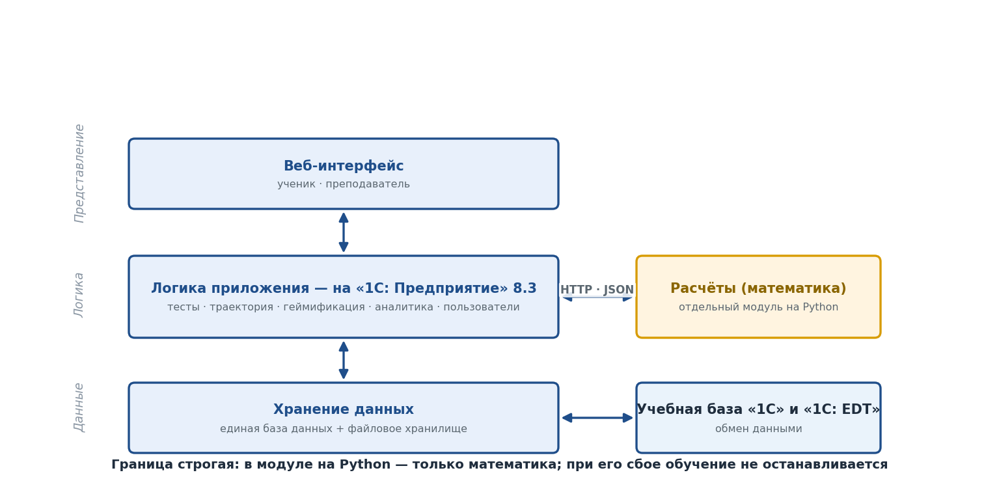
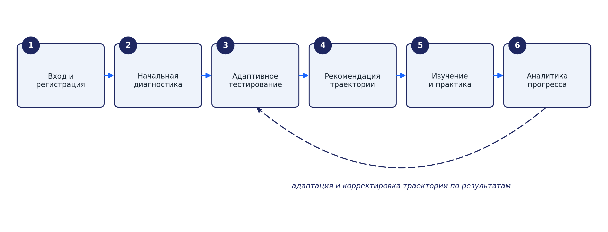
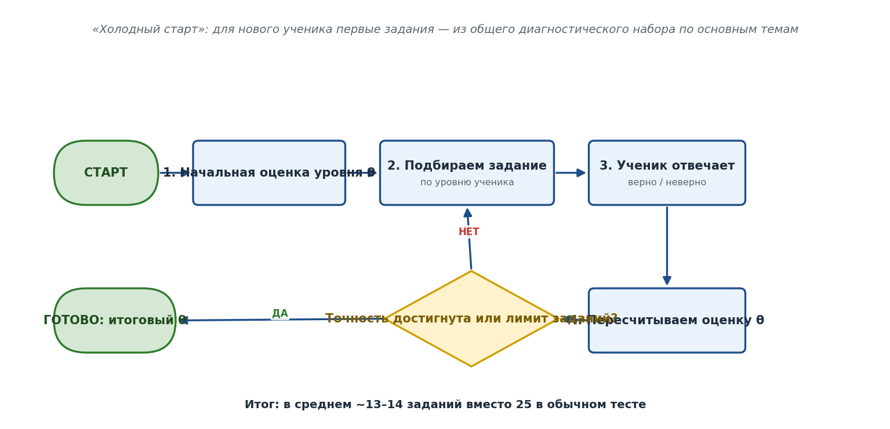
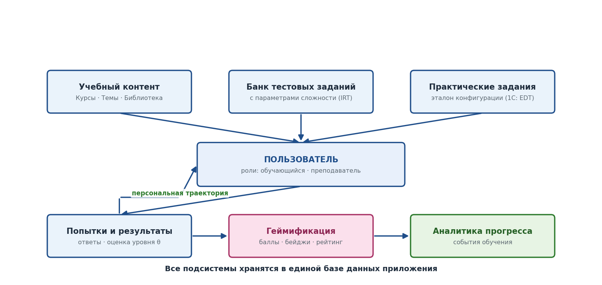

<div align="center">

# Адаптивное обучение и тестирование на «1С: Предприятие» 8.3

**Учебная платформа с адаптивным тестированием на основе теории ответов на задания (IRT),
индивидуальными траекториями обучения, геймификацией и аналитическими дашбордами.**

Выпускная квалификационная работа (магистратура, ФИТ ПГНИУ).


</div>

---

## О проекте

Система обучает разработке на платформе «1С: Предприятие» 8.3 и проверяет подготовленность
обучающегося **адаптивным тестом**: сложность следующего вопроса подбирается под текущий
уровень способности `θ` по моделям IRT (Раша / 2PL). По результатам строится индивидуальная
траектория обучения, начисляется опыт и бейджи, а преподаватель видит прогресс группы на
аналитических дашбордах.

Проект состоит из **двух независимо развёртываемых подсистем**, общающихся по HTTP:

| Подсистема | Технологии | Роль |
|---|---|---|
| **Конфигурация 1С** (`Конфигурация/`) | «1С: Предприятие» 8.3, встроенный язык, СКД, HTML-поле + Chart.js | хранение данных, бизнес-логика, интерфейс, права, регламентные задания |
| **Микросервис IRT** (`Микросервис_IRT/`) | Python 3.11+, FastAPI, NumPy, SciPy | математика IRT: оценка `θ`, выбор задания, калибровка банка |

Граница между подсистемами строгая: в Python-модуле — **только математика**, при его
недоступности обучение не останавливается (в конфигурации есть локальный fallback на модели Раша).

---

## Возможности

- 🎯 **Адаптивное тестирование (CAT)** — выбор задания по максимуму информации Фишера, оценка `θ` методом MLE/MAP, критерии остановки сессии.
- 🧭 **Индивидуальная траектория обучения** — рекомендация следующей темы по порогу `θ` и пререквизитам.
- 🏆 **Геймификация** — начисление опыта (XP), бейджи, рейтинг учебной группы.
- 📊 **Дашборды** — интерактивная аналитика для обучающегося и преподавателя (Chart.js во встроенном HTML-поле управляемой формы).
- 📚 **Встроенная библиотека** учебных материалов с привязкой к темам и встроенным просмотрщиком.
- ⚙️ **Калибровка банка заданий** — оценка параметров трудности `b` и дискриминативности `a` (JMLE / MMLE) по накопленным ответам.

---

## Архитектура



Трёхслойная архитектура (представление → логика → данные). Расчётный модуль на Python вынесен
за границу конфигурации и подключается по `HTTP · JSON`; адрес сервиса задаётся константой
`URLМикросервисаIRT`.

Подробное описание подсистем, протокола обмена и принципов кодирования —
в [`Конфигурация/docs/architecture.md`](Конфигурация/docs/architecture.md).

---

## Структура репозитория

```text
1c-edu/
├── Конфигурация/              # XML-выгрузка конфигурации 1С 8.3 (Configuration.xml в корне)
│   ├── CommonModules/         #   бизнес-логика: ДанныеДашборда, АдаптивноеТестирование,
│   │                          #   Геймификация, ТраекторияОбучения, КлиентIRTСервиса, ...
│   ├── Catalogs/ Documents/   #   справочники и документы предметной области
│   ├── InformationRegisters/  #   оценки θ, параметры IRT, рейтинг, аналитика
│   ├── AccumulationRegisters/ #   баллы опыта
│   ├── Reports/               #   дашборды обучающегося/преподавателя/библиотеки (СКД + HTML)
│   ├── DataProcessors/ Enums/ Constants/ Roles/ Subsystems/ ScheduledJobs/
│   ├── dashboards/            #   HTML-дашборды (Chart.js) + standalone-превью для отладки
│   ├── fixtures/              #   эталонные данные (*_seed.json) + банк заданий по темам
│   ├── tests_1c/              #   интеграционные сценарии (xUnitFor1C)
│   ├── deploy/                #   docker-compose.yml + Dockerfile микросервиса
│   └── docs/                  #   архитектура, развёртывание, руководства, диаграммы
├── Микросервис_IRT/           # внешний сервис расчётов IRT (FastAPI)
│   ├── app/                   #   irt_rasch, irt_2pl, selector, calibration, stopping, schemas
│   └── tests/                 #   unit + integration
├── 1Cv8.dt                    # готовая выгрузка демо-ИБ (загрузка одним файлом)
└── README.md
```

---

## Быстрый старт

### 1. Конфигурация 1С

Вариант **А — из готовой выгрузки ИБ** (быстро, с демо-данными):

1. Создать новую информационную базу → **Загрузить информационную базу** из файла `1Cv8.dt`.
2. Запустить в режиме «1С: Предприятие». Демо-учётки: `student / student`, `teacher / teacher`, `admin / admin`.

Вариант **Б — из исходников (XML-выгрузка)**:

1. Создать пустую ИБ, открыть в **Конфигураторе**.
2. **Конфигурация → Загрузить конфигурацию из файлов…**, указать каталог `Конфигурация/`.
3. **Обновить конфигурацию базы данных** (F7).

Подробнее — [`Конфигурация/docs/deployment.md`](Конфигурация/docs/deployment.md).

### 2. Микросервис IRT

```bash
cd Микросервис_IRT
pip install -e ".[dev]"
uvicorn app.main:app --host 0.0.0.0 --port 8001
```

Либо в Docker:

```bash
cd Конфигурация/deploy
docker compose up -d --build
```

После запуска пропишите адрес сервиса в константу `URLМикросервисаIRT` конфигурации
(например, `http://localhost:8001`).

---

## Как это работает

### Бизнес-процесс обучения



### Адаптивный подбор заданий



На каждом шаге сессии конфигурация передаёт микросервису историю ответов; тот переоценивает
способность `θ` и возвращает следующее задание с максимальной информацией Фишера в точке `θ`.
Сессия завершается по достижении целевой стандартной ошибки оценки или лимита заданий.

### Модель данных



---

## HTTP API микросервиса

Все эндпоинты, кроме `/health`, принимают `POST` с телом JSON. Ключи запросов —
кириллические (имена свойств структур 1С), ключи ответов — латинские.

| Эндпоинт | Назначение |
|---|---|
| `POST /estimate_theta`   | оценка `θ` и стандартной ошибки по истории ответов |
| `POST /select_next_item` | выбор следующего задания по информации Фишера |
| `POST /calibrate_bank`   | калибровка параметров банка (JMLE / MMLE) |
| `GET\|POST /health`      | проба доступности сервиса |

Контракт, примеры запросов/ответов и описание моделей — в [`Микросервис_IRT/README.md`](Микросервис_IRT/README.md).

---

## Тестирование

```bash
cd Микросервис_IRT
pip install -e ".[dev]"
pytest
```

Проверяется монотонность вероятности и пик информации при `θ = b`, несмещённость оценки `θ`,
сходимость адаптивной сессии (RMSE ≤ 0.30 логит при длине теста 15) и восстановление параметров
банка на синтетических данных. Интеграционные сценарии 1С — в [`Конфигурация/tests_1c/`](Конфигурация/tests_1c).
Методика — [`Конфигурация/docs/testing.md`](Конфигурация/docs/testing.md).

---

## Документация

- [Архитектура](Конфигурация/docs/architecture.md)
- [Развёртывание](Конфигурация/docs/deployment.md)
- [Тестирование и апробация](Конфигурация/docs/testing.md)
- [Руководство обучающегося](Конфигурация/docs/student_guide.md)
- [Руководство преподавателя](Конфигурация/docs/teacher_guide.md)
- [API микросервиса IRT](Микросервис_IRT/README.md)

---

## Технологии

**Конфигурация:** «1С: Предприятие» 8.3.27 (управляемое приложение, Taxi), встроенный язык,
система компоновки данных (СКД), поле HTML-документа + Chart.js (транспилирован до ES2017).

**Микросервис:** Python 3.11+, FastAPI, Pydantic v2, NumPy, SciPy; pytest, ruff, mypy; Docker.

> Проект академический (ВКР). Метаданные, идентификаторы и комментарии в коде — на русском
> языке в соответствии с принятыми в проекте соглашениями.
